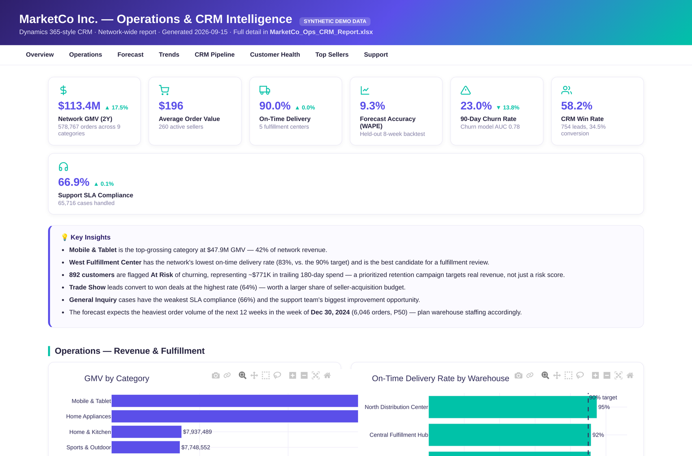
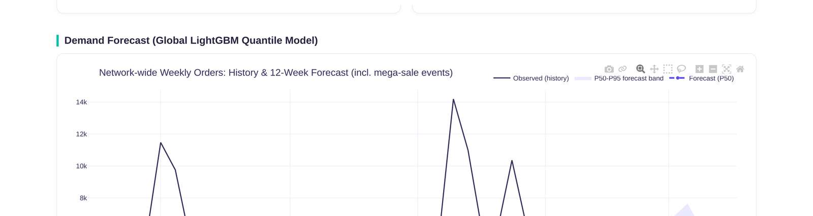
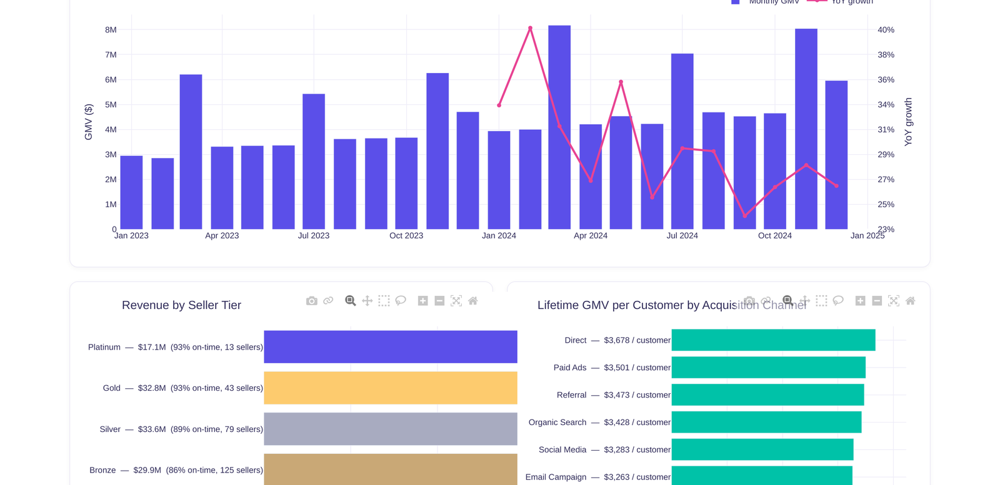
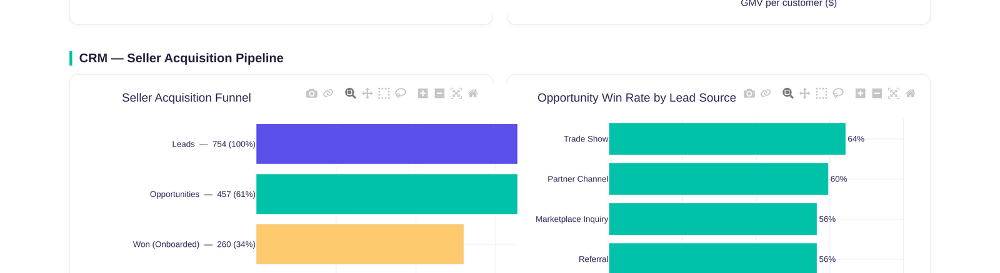
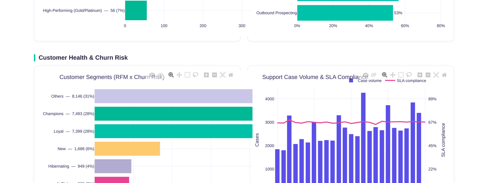
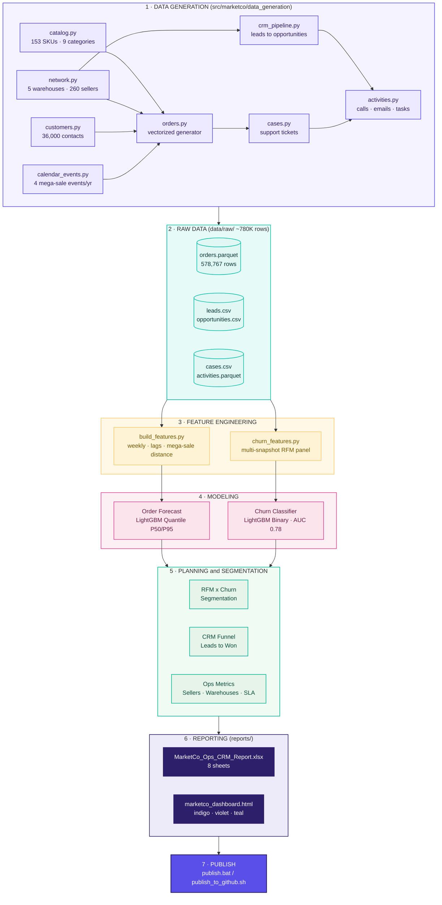

# MarketCo Marketplace Intelligence

**Marketplace operations forecasting and Dynamics 365-style CRM analytics for a large multi-seller e-commerce platform.** A synthetic, large-scale (~780K-row) dataset for a fictional marketplace company, "MarketCo Inc." (conceptually modeled on large regional multi-seller e-commerce platforms such as Digikala): 5 fulfillment centers, 260 sellers, 36,000 customers, 578,767 orders, and a full Microsoft Dynamics 365-style CRM layer (Leads, Opportunities, Accounts, Contacts, Cases, Activities) - a global LightGBM order-volume forecaster that explicitly models the marketplace's own mega-sale calendar, a customer-churn classifier with RFM segmentation, and both an 8-sheet Excel workbook and a standalone interactive HTML dashboard rendered from one source of truth.

[](https://github.com/Milad-Shabani/marketco-marketplace-intelligence/actions)


> ⚠️ **All data in this repository is synthetically generated.** "MarketCo" is fictional. See [Data provenance](#data-provenance).

---

## The business problem

MarketCo runs four mega-sale events a year - each one a multi-day spike that can be 3-7x normal order volume - and needs warehouse staffing and courier capacity planned around them, not just around steady-state demand. At the same time, roughly a quarter of active customers go quiet within any 90-day window, and the CRM team needs to know *which* customers are worth a retention push before they're gone, not after. This project builds both halves: an operations forecast that treats promotional spikes as a first-class feature (not noise to smooth over), and a churn model built the way a Dynamics 365 + e-commerce data stack actually supports it - RFM behavior fused with CRM engagement signals.

## What's inside

| Layer | What it does |
|---|---|
| **Data generation** | 153 SKUs x 5 warehouses x 260 sellers x 36,000 customers -> 578,767 orders over 2 years, with a realistic 4-event annual mega-sale calendar; a full Dynamics 365-style CRM layer (Leads -> Opportunities -> Won/Lost, Cases, Activities) internally consistent with the operational data |
| **Operations forecasting** | One global LightGBM model (not 9 per-category models) with **P50/P95 quantile regression**, explicitly featuring distance-to-nearest-mega-sale-event |
| **CRM analytics** | A multi-snapshot RFM + CRM-engagement panel feeding a LightGBM **churn classifier**, evaluated with a time-based split; RFM x churn-risk customer segmentation |
| **Reporting** | An 8-sheet Excel workbook with native charts, and a standalone interactive HTML dashboard (indigo/violet/teal theme) - both rendered from the same computed tables |

## Results at a glance

| Metric | Value |
|---|---:|
| Order-volume forecast accuracy (WAPE, 8-week holdout) | **9.3%** (1-3.5% in normal weeks, 10-14% in mega-sale weeks) |
| Forecast R² | **0.82** |
| P95 interval coverage (target: 95%) | **90.3%** |
| Churn model AUC-ROC | **0.781** |
| 90-day churn rate (base rate) | **26.1%** |
| CRM lead conversion rate | 34.5% (754 leads -> 260 onboarded sellers) |
| Opportunity win rate | 58.2% |
| Support SLA compliance | 66.9% (65,716 cases) |

Full breakdown in [`reports/order_model_performance.csv`](reports/order_model_performance.csv), [`reports/churn_model_performance.csv`](reports/churn_model_performance.csv), and [`docs/methodology.md`](docs/methodology.md).

## Dashboard Preview

The full interactive dashboard (`reports/marketco_dashboard.html`) opens directly in any browser — no server required. A few highlights below; open the file itself for the live, hoverable Plotly charts and the full customer/seller tables.

**Overview — KPIs with trend deltas, and auto-generated key insights:**



**Demand forecast — history plus a 12-week P50/P95 forecast, visibly shaped by the mega-sale calendar:**



**Business trends — full 2-year monthly GMV with YoY growth, revenue by seller tier, and lifetime value by acquisition channel:**



**CRM seller-acquisition funnel and win rate by lead source:**



**Customer segmentation and support case volume / SLA trend:**



## End-to-End Pipeline Flow



<sub>Static preview (in case your Markdown viewer doesn't render Mermaid): <a href="docs/pipeline_flow.png">docs/pipeline_flow.png</a></sub>


## Repository layout

```
marketco-marketplace-intelligence/
├── src/marketco/
│   ├── data_generation/     # catalog, network, customers, orders, calendar events,
│   │                        # CRM pipeline (leads/opportunities), cases, activities
│   ├── features/            # order-volume weekly features + churn RFM/CRM panel
│   ├── models/               # order forecast (LightGBM quantile) + churn classifier
│   ├── planning/             # RFM segmentation, CRM funnel, ops metrics
│   └── reporting/            # Excel workbook + HTML dashboard builders
├── scripts/
│   ├── generate_sample_data.py     # produces data/raw/*
│   ├── run_pipeline.py             # features -> forecast -> churn -> planning -> reports
│   ├── publish_to_github.sh        # one-shot publish (Linux/macOS)
│   └── publish.bat                 # one-shot publish via GitHub CLI (Windows)
├── data/raw/                 # generated synthetic source data (committed)
├── data/processed/           # weekly features + churn panel (committed)
├── reports/                  # MarketCo_Ops_CRM_Report.xlsx + dashboard.html (committed)
├── docs/                     # data dictionary + methodology
├── tests/                    # 25 pytest unit tests
└── .github/workflows/ci.yml  # regenerates everything + tests on every push
```

## Getting started

```bash
git clone https://github.com/Milad-Shabani/marketco-marketplace-intelligence.git
cd marketco-marketplace-intelligence
pip install -r requirements.txt

# 1. Generate the synthetic dataset (deterministic, seeded, ~15-20 seconds)
python scripts/generate_sample_data.py

# 2. Run the full pipeline: order forecast, churn model, planning, both reports
python scripts/run_pipeline.py

# 3. Run the test suite
pytest tests/ -v
```

Or with `make`: `make install data pipeline test`.

Open `reports/marketco_dashboard.html` directly in a browser (no server needed - Plotly is embedded inline), or `reports/MarketCo_Ops_CRM_Report.xlsx` in Excel.

**Publishing to GitHub:** on Windows (with [GitHub CLI](https://cli.github.com/) installed and `gh auth login` already run), edit the `cd /d` path at the top of `scripts\publish.bat` and run it. On Linux/macOS, create an empty repo on github.com first, then run `./scripts/publish_to_github.sh <remote-url>`.

## Why model a promotional calendar explicitly?

Naive time-series forecasting treats a 5x demand spike as an outlier to smooth away. Real marketplace ops teams live and die by exactly those spikes - warehouse overtime, courier surge contracts, and inventory pre-positioning all get planned around the promotional calendar. `weeks_to_mega_sale` (a signed distance-to-nearest-event feature) lets the global LightGBM model anticipate the ramp-up and the comedown instead of only reacting to lagged history, and the honest backtest result - low error in normal weeks, 10-14% error in event weeks - is reported as a finding, not smoothed over. See [`docs/methodology.md`](docs/methodology.md#2-operations-forecasting-order-volume).

## Why a time-based split (not random) for the churn model?

The churn panel pools 14 monthly snapshots, and the same customer appears in multiple snapshots. A random train/test split would let the model see a customer's *later* behavior during training and be evaluated on their *earlier* behavior - leaking future information and overstating accuracy. Training on the first 12 snapshots and testing on the final 2 mirrors exactly how the model would be deployed: trained on history, scored against the current customer base going forward. See [`docs/methodology.md`](docs/methodology.md#3-crm-analytics-churn-prediction) for the full discussion, including why the model is used as a **risk-ranking** tool (percentile/tier) rather than a fixed-threshold classifier.

## Data provenance

This project ships **entirely synthetic** data:

- Company, sellers, warehouses, and customers are fictional; all GMV, CRM, and support figures are simulated.
- The promotional calendar (Nowruz sale, mid-year mega sale, MarketCo Friday, Yalda-night sale) is inspired by real regional shopping-season patterns, used only to make the seasonality realistic.
- The CRM entity model (Leads, Opportunities, Accounts, Contacts, Cases, Activities) follows the standard Microsoft Dynamics 365 schema shape, chosen because the brief specified a Dynamics-365-style CRM backbone - no real Dynamics 365 tenant or customer data is used.

Full generation methodology in [`docs/methodology.md`](docs/methodology.md) and [`docs/data_dictionary.md`](docs/data_dictionary.md).

## Possible extensions

- A proper multi-line order/order-line schema instead of one-product-per-order (see the simplification note in `docs/methodology.md`).
- Survival analysis (Cox proportional hazards or a discrete-time hazard model) as an alternative to the fixed-90-day churn label.
- Per-seller demand forecasting for seller-facing inventory recommendations, mirroring the companion PharmaPulse project's per-SKU approach.
- A live Dynamics 365 / Dataverse connector to replace the synthetic CRM tables with real (permissioned) data.

## License

MIT - see [LICENSE](LICENSE).
